# 研究心路歷程:凍結行為基礎模型的跨體型 latent 適應

> 報告參考用。依時間順序說明每一步**為什麼這樣做、結果是什麼、為什麼那條路不行**,最後是結論與發表前還缺的工作。
> 圖檔與影片都在 `docs/figures/journey/`。所有數字若無特別說明,都是 `cost / 該 (動作, 身體) 的 z0 cost` —— **1.0 = 什麼都不調,越低越好**。
> 例外:**影片畫面與影片說明裡的數字是絕對成本**(bfm cost 本身),方便對照畫面。

---

## 0. 一頁摘要

**問題**:Meta Motivo(一個凍結的行為基礎模型,BFM)用一個 256 維的 latent z 控制人形機器人。在成人身體上有效的 z0,換到比例不同的身體(例如小孩)就會失效。能不能用身體參數 β 算出新身體該用的 z?

**最初的做法**:訓練一個 adapter `z = G(β, z0)`,期待它學會所有動作、所有身體。

**發現**:

1. **沿「動作」這個軸學不起來** —— 每個動作需要的修正方向彼此正交,一個動作調好的 z 用在別的動作上會變差 1.99 倍。這解釋了前兩週所有 adapter 訓練的失敗。
2. **沿「身體」這個軸可以** —— 一個身體調好的 z,可以直接用在體型相近的身體上,效果隨體型距離平滑衰減;四個形變方向都成立。
3. **沿體型參數連續追蹤**,得到一條有序、可以內插的 β → z 軌跡;對沒看過的中間體型,零搜尋就拿回約 72–86% 的最佳化收益(四條路徑)。
4. **latent 的敏感度集中在四肢長度**,而且縮小遠比放大傷(腿縮到 0.5 倍:2.72×;其他維度 ≈ 1.0)。

**尚未成立**:推廣到**任意**新體型 —— 目前零搜尋只拿回約 30% 收益。

---

## 1. 時間線總覽

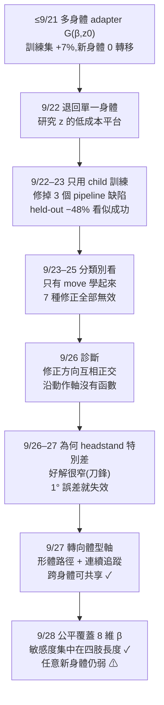

| 階段 | 問的問題 | 結論 |
|---|---|---|
| 1 | 一個 adapter 能不能服務所有身體和動作? | 不行,而且當時的訓練設定本身有缺陷 |
| 2 | 單一身體、單一動作的「好 z」長什麼樣? | 是一個 32–64 維的大平台,不是一個點 |
| 3 | 固定身體,z0 → z 能不能學? | 平均看能(−48%) |
| 4 | 分類別看呢? | 只有 move 學起來,其他類別甚至變差 |
| 5 | 為什麼? | 不同動作需要的修正互相正交,沒有可學的函數 |
| 6 | 那改走什麼軸? | 體型軸:修正可以跨體型共享,且可內插 |
| 7 | 能推廣到任意新體型嗎? | 還不行;但找到了關鍵維度(四肢長度) |

---

## 2. 階段一(≤ 9/21):多身體 adapter

**為什麼這樣做**:最直接的想法 —— 把 β 和 z0 餵進 MLP,輸出修正後的 z。凍結的 BFM 只能透過 z 控制,所以只訓練這個小網路;用 ES(進化策略)估梯度,因為成本要跑物理模擬才算得出來,不可微。

**結果**:probe sweep A–H,訓練集成本只降約 7%,held-out 身體完全沒有轉移。

**為什麼不行**(事後才知道):
- 當時的 10 身體資料集**不含 child**,而 9/10 個身體的 z0 成本中位數本來就 < 0.21 —— 幾乎沒東西可學。
- 資料集的 XML 用的是**成人的致動器**,小孩身體實際被放大了約 4.7 倍的力量。
- rollout 從 T-pose 開始,而所有單點搜尋都從參考動作的第一幀開始。

這三個缺陷在階段三被發現並修正;階段一的數字因此都不可比較。

---

## 3. 階段二(9/22):退回單一身體,研究「好 z」的形狀

**為什麼**:在問「z 如何隨 β 變化」之前,先要知道對一個身體、一個動作,「好的 z」是一個點還是一片區域。如果是一片,那「最佳 z」本身就定義不清。

**結果**(小孩 × move-ego-0-2_4):

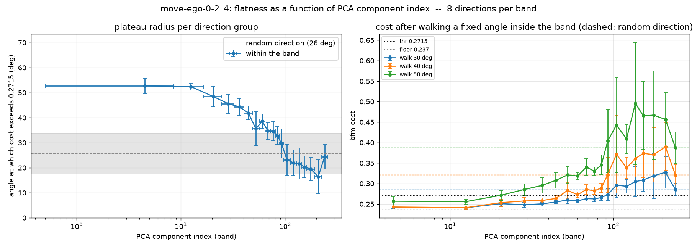
*F01 — 沿不同主成分方向走多遠成本才會超過門檻。前 ~32 個方向可以走 45–50° 仍然很平,第 65 個以後跟隨機方向一樣。好 z 是一個約 32–64 維的有界區域。*

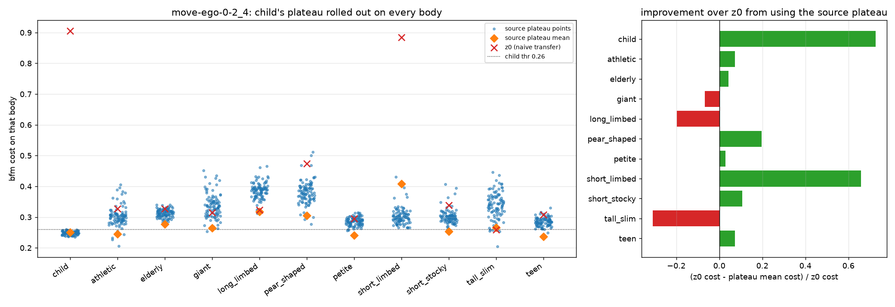
*F02 — 把小孩的平台拿到其他身體跑。平台上的**個別點**幾乎不轉移,但平台的**中心**在 8/11 個身體上比 z0 好。*

**當時的解讀**:搜尋找到的「最佳 z」都停在平台邊緣,比較不同身體的最佳 z 只是在比較邊緣雜訊。

**事後看**:F02 其實已經預告了最後的核心發現(體型之間可以共享),但當時沒有沿這條線走下去,而是回頭做 adapter 訓練。

---

## 4. 階段三(9/22–23):只用小孩身體訓練 adapter

**為什麼**:固定一個身體,β 變成常數,問題縮成「z0 → z 能不能學」—— 這是加入 β 之前的前提。

**做了什麼**:修掉階段一的三個缺陷(加入 child、改用 torque 校準的 XML、reference 初始姿態);另外發現 lr 1e-3 會發散(`z = z0 + MLP` 沒有上界,z 漂離 z0),改用 lr 3e-4。

**結果**:held-out 動作的成本 0.671 → 0.351,**−48%**,訓練與測試一起下降,沒有過擬合。

**看似成功** —— 但這是平均值。

---

## 5. 階段四(9/23–25):分類別看,只有 move 學起來

**為什麼**:資料 540 個動作裡大多是 move(走路類)。平均進步可能只是 move 在撐。於是重新平衡資料(500 個 clip,各類別增補 rollout),並改用 `cost / cost_z0` 分類別看。

**結果**:

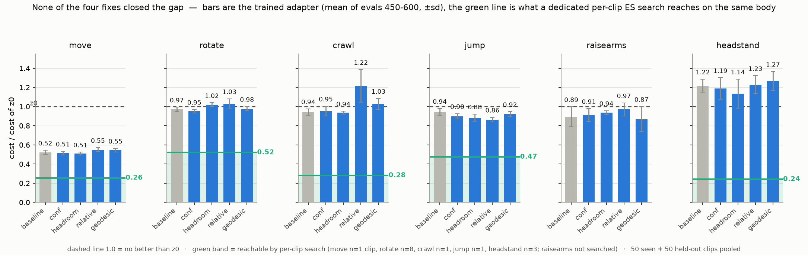
*F03 — 分類別的相對成本。move 降到約 0.52,headstand 反而變差(1.22,比不調還糟)。圖中四種修正(依訊號強度加權、依剩餘空間加權、相對分數、有界的 geodesic head)全部落在雜訊範圍內。*

**試過、全部無效的修正**:

| 做法 | 假設 | 結果 |
|---|---|---|
| 依每列訊號強度重新加權 | rank normalize 替已收斂的 clip 製造假梯度 | −0.012(雜訊內) |
| 依剩餘改善空間加權 | move 成本高、主導梯度 | −0.011 |
| 相對分數 + 不做 rank | 尺度不公平 | +0.062(更差) |
| 有界 geodesic head | 輸出沒有上界 | +0.019(界限從未被觸及) |
| 類別均勻取樣 | move 佔 40% 的預算 | +0.042 |
| 訓練加長到 1000 步 | 還沒收斂 | u400 觸底後回升,只有 move 繼續進步 |

**決定性的一個實驗**:只用 headstand 訓練(每個 clip 的預算是原本的 14 倍,完全沒有其他類別干擾)。

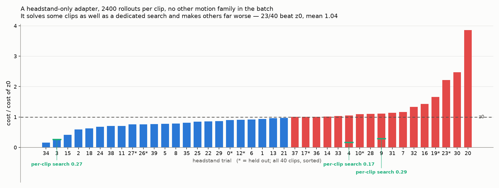
*F04 — 40 個 headstand clip:有的追平專門搜尋的結果,有的變差 2–4 倍;連它自己的 32 個訓練 clip 平均都是 1.012。*

→ 同時排除了「預算不夠」「類別互相干擾」「無解」三個解釋。剩下的只有**映射本身**。

---

## 6. 階段五(9/26):診斷 —— 沿「動作」軸沒有可學的函數

**做法**:對 40 個 headstand clip 各自做專門搜尋(每個 5000 次 rollout),得到每個 clip 的目標 z,然後問這些目標之間有沒有結構。

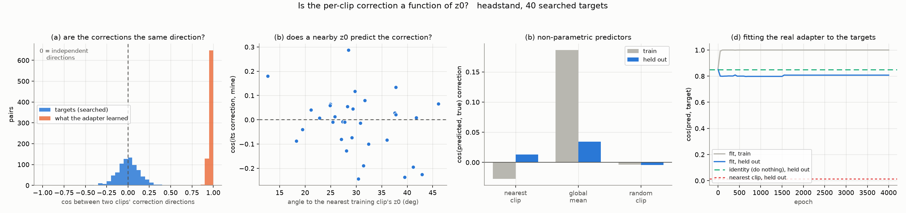
*F05 — (a) 40 個目標的修正方向兩兩 cos = **+0.003**(互相垂直),而 adapter 學到的方向兩兩 cos = +0.973(全部同一方向);(b) z0 最接近的 clip,其修正並不比隨機挑的更準;(d) 監督式擬合在訓練集誤差 0.01°,沒看過的 clip 反而比 z0 更遠離答案。*

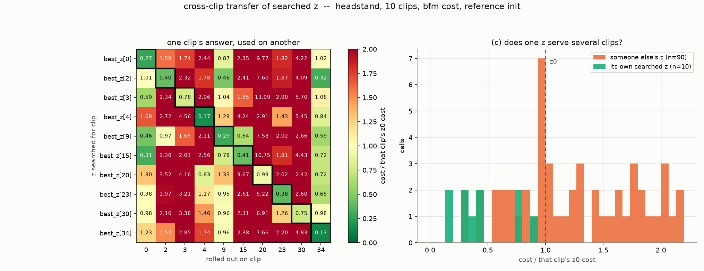
*F06 — 把 clip A 的最佳 z 拿去跑 clip B(10×10)。對角線 0.45,非對角線中位數 **1.99**,90 組裡只有 21 組比不調好。從這 10 個候選挑一個給所有 clip,最好的選擇就是 z0 本身。*

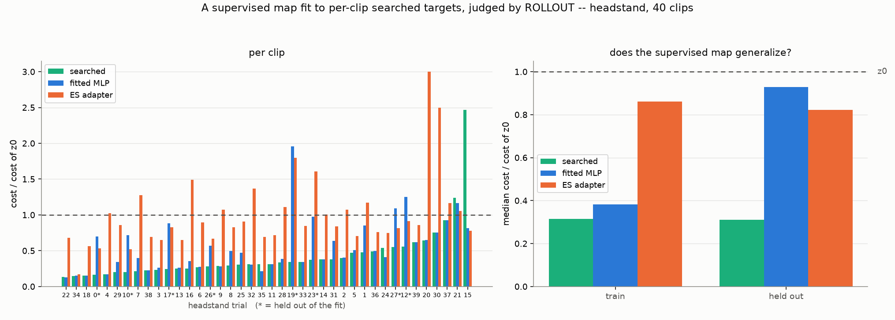
*F07 — 用完美目標做監督式擬合、再實際 rollout:訓練 clip 0.44(完美重現),沒看過的 clip 1.02(跟不調一樣)。*

**結論**:每個動作要的修正彼此無關,不同動作的「好區域」不重疊。一個以 z0 為輸入的共享網路,在這個軸上只能背答案,不能推廣 —— 這解釋了前面所有 adapter 實驗的天花板。

---

## 7. 階段六(9/26–27):為什麼只有 headstand 特別差

排除了三個直覺解釋,找到真正原因:

| 假設 | 檢驗 | 結果 |
|---|---|---|
| headstand 的解離 z0 特別遠 | 各類別最佳 z 離 z0 的角度 | ✗ headstand 最近(28°),move 53° |
| z0 和解之間有一道牆 | 沿 z0 → 最佳 z 的直線量成本剖面 | ✗ 走 0.5–3.7° 就已經低於 z0 |
| **好區域特別窄** | 沿路徑上成本 < 0.8 的寬度 | ✓ headstand **14°**,move/rotate **60°** |

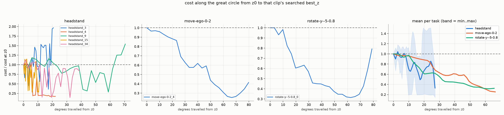
*F08 — 從 z0 走向各自的最佳 z。move 和 rotate 一路緩降,headstand 的好區域只有幾度寬(headstand_3 的 <0.5 區只有 0.5°)。*

**接著驗證**:用 best-point buffer(記住模擬器量過的最佳點、精確地拉過去,`lambda_bc`)改善了卡住的類別(raisearms 0.80 → 0.51,headstand 1.28 → 1.13),而且 buffer 自己已經找到 headstand 0.525 的解。但 adapter 離這些好點**平均差 8.3°**,在窄窗口上就足以失敗。更關鍵的是,即使用監督式擬合把誤差壓到 **1°**,headstand 仍只有 0.964 —— 一度的誤差就吃掉幾乎全部收益。

**方法論上的教訓**:這個階段我提出過兩個機制解釋(「ES 把各 clip 的訊號平均掉了」、「z0 周圍有牆」),都被自己設計的模擬推翻。最後的答案是**直接量真實地形**得到的,不是推理得到的。

---

## 8. 階段七(9/27):轉向體型軸

**為什麼轉向**:沿動作軸的結論已經很清楚(不存在函數)。但這個研究原本的主張是 `z = G(β, z0)` 要**推廣到新身體**,不是推廣到新動作 —— 這個軸從來沒有直接測過。

**文獻定位**:
- Sikchi et al. 2025(*Fast Adaptation with BFMs*):在 BFM 的 latent 空間搜尋能改善 zero-shot 表現,但**身體固定**。
- Kang et al. 2025(*Model-Homotopy Transfer*):沿連續變形的身體遷移,但**微調整個策略**。
- 空白:凍結 BFM、只動 latent、系統性地刻畫最佳 latent 如何隨 β 變化。

**設計**:在 β 空間從成人**直線內插**到目標身體,造出一串中間身體(t = 0, 1/8, …, 1)。比較兩種找 z 的方式:
- **獨立搜尋**:每個身體都從 z0 出發
- **連續追蹤**:每個身體從前一個身體的解出發

共做了四條路徑:整體縮小(→ 小孩)、只縮四肢、整體放大(→ giant)、變粗(→ short_stocky)。

**先看問題本身**:

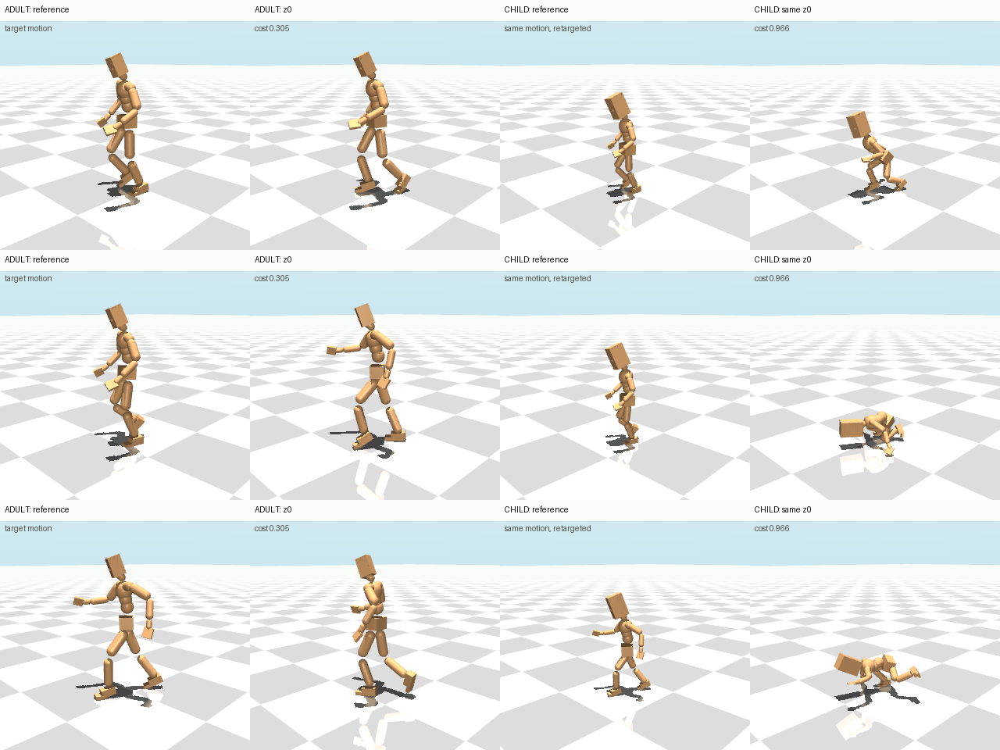
*V1(`v1_problem_move-ego-0-2-raisearms-h-h_6.mp4`)— 同一個 z0:成人正常行走(0.305),小孩直接跌倒(0.966)。*

### 8.1 連續追蹤得到的是一條有序軌跡

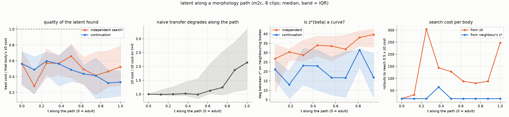
*F09 — 沿成人 → 小孩路徑。左二:z0 在 t > 0.5 後迅速退化(小孩端 2.14×)。右:從相鄰身體的解出發,9 個身體中 8 個只要 16 次 rollout 就達到 0.5× z0(另一個 64 次);從 z0 出發要 80–304 次。*

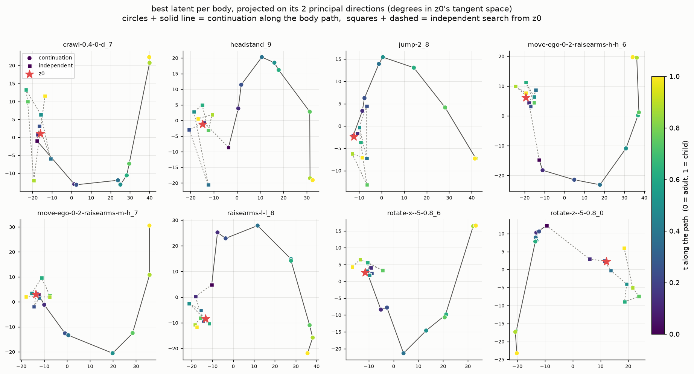
*F10 — 每個 clip 的 9 個最佳 z 投影到主成分上。獨立搜尋(方塊)是 z0(紅星)周圍一團顏色混雜的點;連續追蹤(圓點)依體型順序排成一條往外延伸 40–60° 的線。8/8 個 clip 都一樣。*

**關鍵對照**(防止誤讀):連續追蹤在遠端身體的結果較好,但它一路總共用了 9 × 512 次 rollout。給獨立搜尋**同樣總預算**(一次 4608 次的長搜尋)後:

```
中位數:獨立 512 次 0.524   長搜尋 4608 次 0.287   連續追蹤 0.332   → 連續追蹤只贏 1/8
```

所以**連續追蹤不是更好的最佳化器**。它真正的價值在下面兩點。

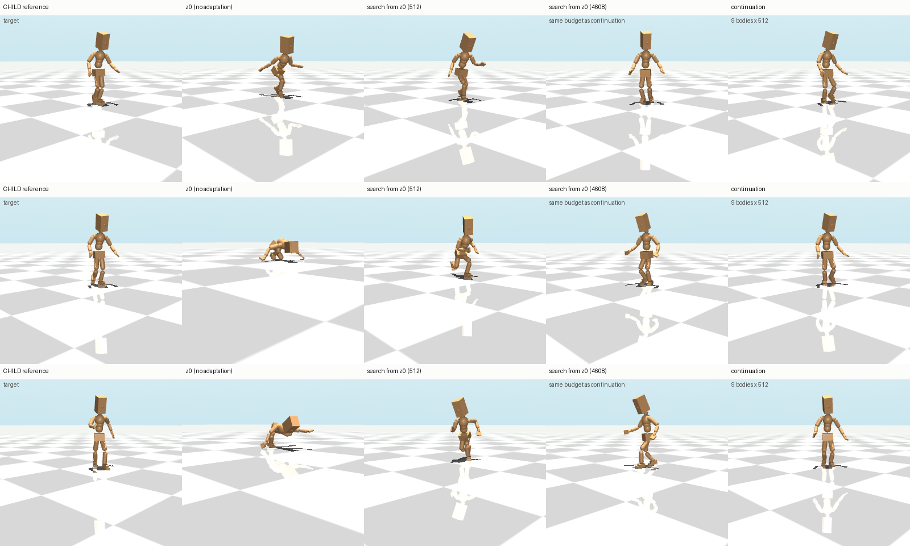
*V2(`v2_adapted_child_move-ego-0-2-raisearms-h-h_6.mp4`)— 小孩身體上:z0 跌倒(0.966);從 z0 搜 512 次勉強站著(0.751);同預算長搜尋(0.240)與連續追蹤(0.275)都接近參考動作。*

### 8.2 跨身體可以共享,跨動作不行

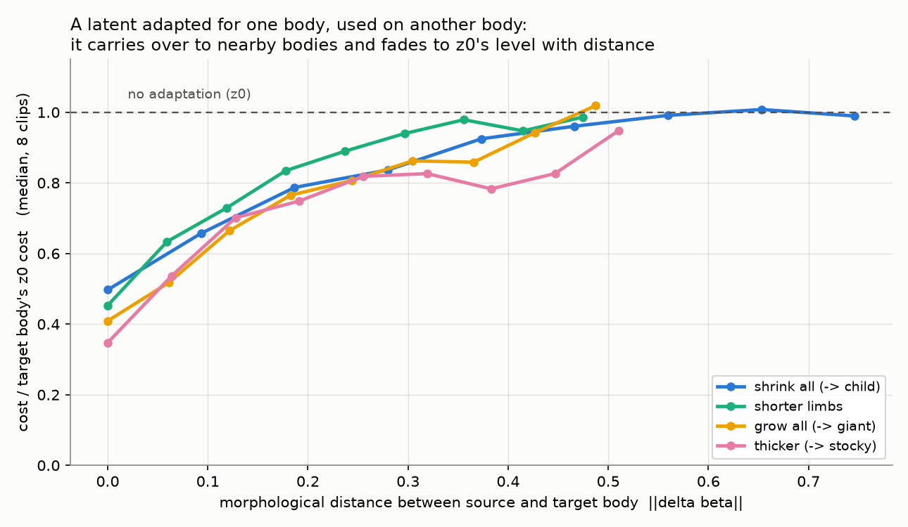
*F11 — 把一個身體調好的 z 用在另一個身體上:相鄰一步 0.52–0.66,隨體型距離平滑衰減,最遠退回 ≈ 1.0(不會變害)。四條路徑一致。*

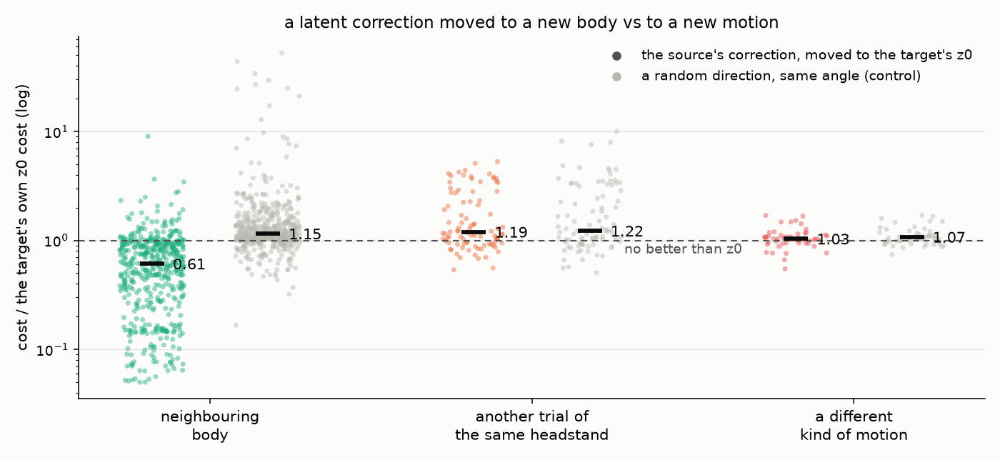
*F16 — 把修正量沿球面搬到目標自己的 z0 上:相鄰身體 0.61(同角度隨機方向 1.15,461/512 組較好);其他倒立 trial 1.19(隨機 1.22);不同類別動作 1.03(隨機 1.07)。*

### 8.3 沿路徑可以內插

拿掉路徑上一個身體,只用它兩側鄰居的 z 做球面內插(零搜尋):

| | 縮小 | 縮四肢 | 放大 | 變粗 |
|---|---|---|---|---|
| 該身體自己搜尋(上限) | 0.497 | 0.453 | 0.409 | 0.347 |
| **連續追蹤的解,鄰居內插** | **0.596** | **0.559** | **0.489** | **0.528** |
| 獨立搜尋的解,鄰居內插 | 0.690 | 0.683 | 0.618 | 0.756 |

- 內插勝過直接抄最近鄰(56 組中 33–44 組),零搜尋拿回該身體搜尋收益的 72–86%。
- **連續追蹤的解遠比獨立搜尋的好內插** —— 這才是連續追蹤的真正貢獻:它產生彼此一致、可以學的目標。這正好是階段五缺的東西(獨立搜尋的目標是從大平台任意挑的,所以互相正交)。

---

## 9. 階段八(9/28):公平覆蓋 8 維體型參數

**為什麼**:四條斜線路徑只覆蓋 8 維 β 空間的 4 個方向;推廣到真實身體時表現很弱,懷疑是覆蓋不足。

**設計**:8 維 × 正負兩方向 = 16 條軸向路徑,每條**只改一維**,走到 19 個真實身體在該維的極值,同樣 4 步。身體庫擴充到 100 個。

### 9.1 新發現:敏感度集中在四肢長度

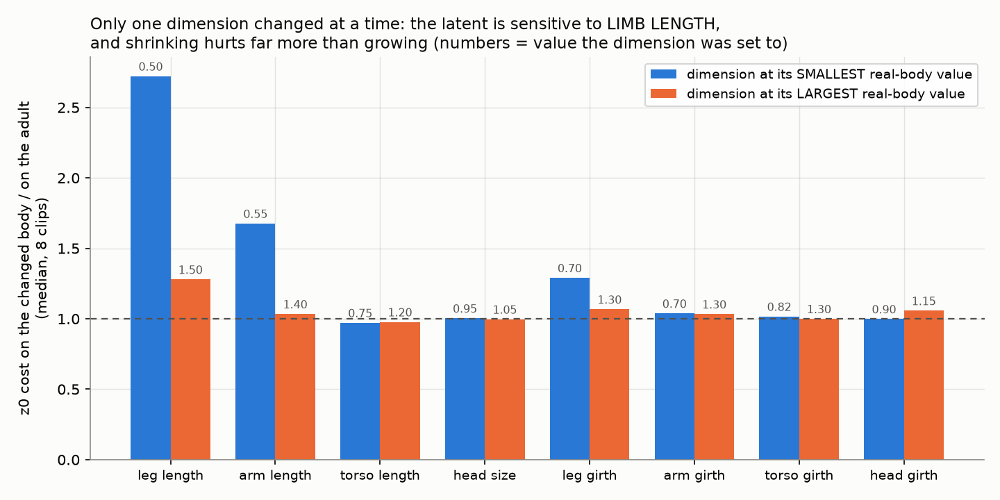
*F12 — 一次只改一維。腿縮到 0.5 倍:2.72×;手縮到 0.55 倍:1.68×;其餘(軀幹、頭、粗細)改到極值都 ≈ 1.0。縮小遠比放大傷。*

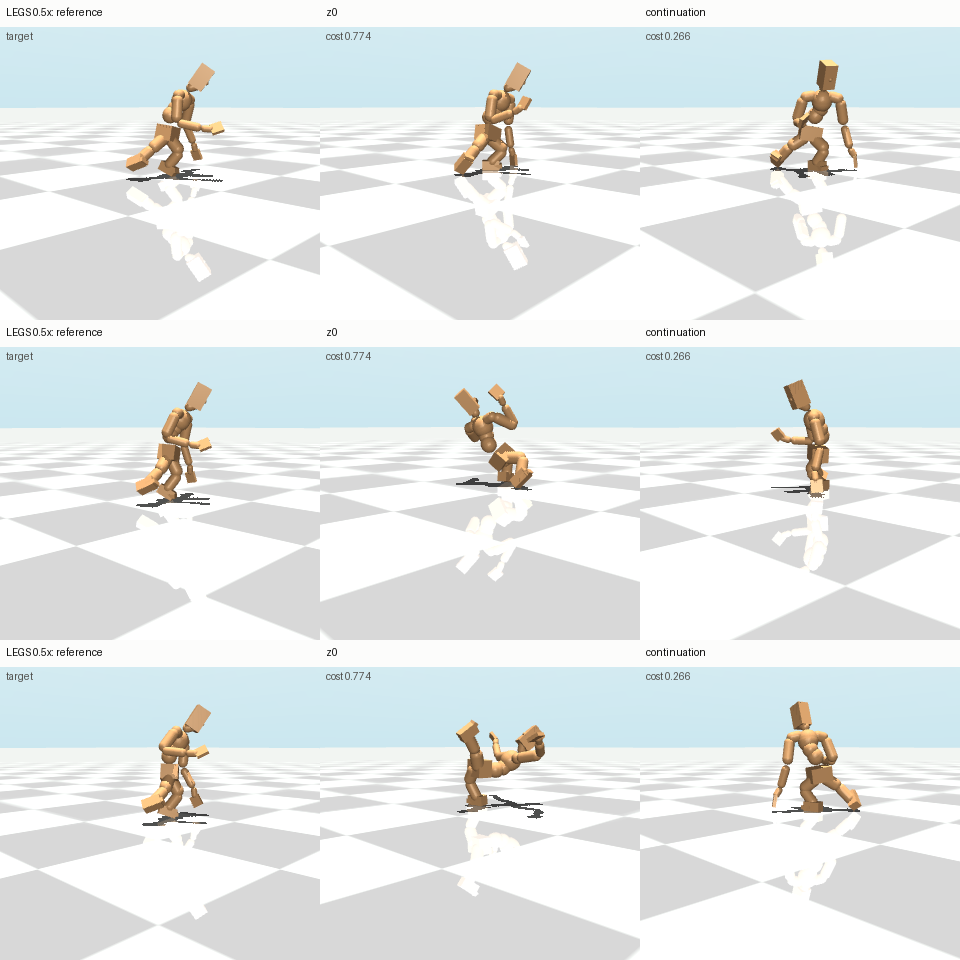
*V3(`v3_leg05_rotate-z--5-0.8_0.mp4`)— 腿縮到 0.5 倍:z0 摔倒(0.774),連續追蹤的解能站住做旋轉(0.266)。另一支 `v3_leg05_crawl-0.4-0-d_7.mp4` 是失敗案例:搜尋後仍有 0.804 —— 縮短腿是最難的方向。*

### 9.2 推廣到真實身體:有改善,但仍弱

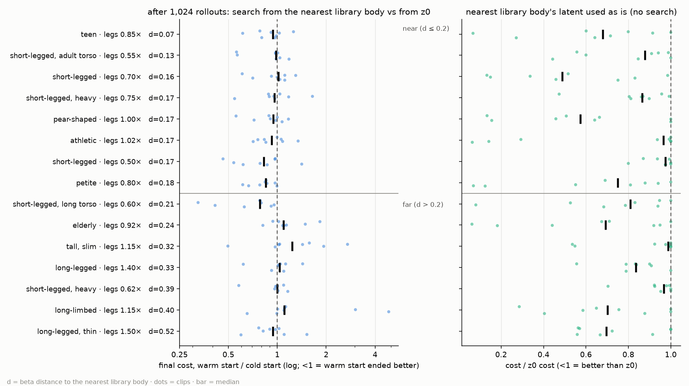
*F13 — 15 個保留的真實身體(都不在任何路徑上),依和 100 個身體庫中最近身體的 β 距離排序,橫線以上是近處(d ≤ 0.2)。左:各搜 1,024 次後,暖啟動 ÷ 冷啟動的最終成本(小於 1 = 暖啟動較好);右:直接用最近庫身體的 latent 的成本。*

| held-out 真實身體,零搜尋拿回的收益 | 舊庫(36 身體) | 新庫(100 身體) |
|---|---|---|
| 核迴歸,全部 | 15% | **21%** |
| 切空間線性模型,近(‖Δβ‖ ≤ 0.2) | 4% | **33%** |
| 暖啟動搜 1,024 次後比冷啟動好(近 / 遠) | 71% / 44% | 70% / 46% |

(9/30 起核迴歸改為「把庫裡身體的修正量依 β 距離加權平均,再從 z0 走出去」,與修正量搬移實驗一致;舊版是把 latent 本身在球面上平均,100 個身體的庫為 28%。新舊逐格比較各贏一半,bootstrap 差異 95% 信賴區間 [−11%, +2%],屬雜訊範圍。)

原因:真實身體通常**同時**改變好幾維,單軸路徑在歐氏距離上靠不近它們(100 個庫身體裡,只有 4 個真實身體換到更近的鄰居)。

---

## 10. 最終結論

| | 論點 | 證據 | 強度 |
|---|---|---|---|
| C1 | 樸素轉移隨體型距離退化;BFM 自己對重定向動作的推論救不了 | 縮成小孩 2.14×;retarget 推論 1.10× z0 | ✅ |
| C2 | latent 搜尋能回收效能,成本取決於解離 z0 多遠 | headstand 16 次、move 936 次到 0.5× | ✅ |
| C3 | **latent 修正不能跨動作共享** | 修正方向正交(cos +0.003);跨動作 1.99× | ✅ |
| C4 | **latent 修正可以跨體型共享,隨距離平滑衰減** | 四條路徑:相鄰 0.52–0.66,最遠 ≈ 1.0 | ✅ |
| C5 | 連續追蹤揭露由體型參數化的有序 latent 軌跡 | 8/8 clip;位移主成分佔 55% vs 27% | ✅ |
| C6 | 沿路徑可內插;連續追蹤的解遠比獨立搜尋好內插 | 內插 0.49–0.60;勝過最近鄰 | ✅ |
| C7 | 用 β 推廣到任意新體型 | 零搜尋 21–33% 收益;暖啟動近處 70% 較好、遠處約一半 | ⚠️ 弱 |
| C8 | 敏感度集中在四肢長度,縮小比放大傷 | 腿 0.5× → 2.72×;其他維 ≈ 1.0 | ✅ |

**一句話**:凍結 BFM 的跨體型適應,**該共享的是體型,不是動作**;沿體型參數連續追蹤能得到可內插的 β → latent 映射,而決定這個映射的主要是四肢長度。

---

## 11. 走不通的路(報告 Q&A 用)

| 路 | 為什麼不行 | 證據位置 |
|---|---|---|
| 一個 adapter 學所有動作 | 各動作的修正互相正交,沒有函數可學 | 階段五,F05–F07 |
| 各種 ES 加權、取樣、架構調整 | 問題不在優化,在映射本身 | 階段四,F03 |
| 訓練更久 | u400 觸底後回升 | 階段四 |
| 加大預算 / 排除干擾 | headstand-only 14 倍預算仍失敗 | F04 |
| 監督式擬合完美目標 | 只能背答案,新動作 = 不調 | F07 |
| 多峰模型(CVAE、MDN) | 輸出端沒有被平均;每個 clip 只要一個解,一般網路就能 0.01° 擬合 | 階段六 |
| 「連續追蹤找到更好的解」 | 同預算的長搜尋一樣好 | 階段七 8.1 |
| 「搜尋很便宜,不用加速」 | 只對 headstand 成立;move 要上千次 | C2 |
| BFM 自己推論新體型的 z | 比 z0 還差(1.10×) | C1 |

---

## 12. 方法論上的教訓

1. **先看分類別,不要只看平均**。−48% 的平均進步幾乎全部來自一個類別,其他類別甚至變差。
2. **「看起來成功」要做同預算的對照**。連續追蹤的品質優勢,在長搜尋對照下完全消失。
3. **機制推論要用實驗驗證**。兩個聽起來合理的解釋都被模擬推翻;真正的答案來自直接量測地形。
4. **小心「測試集」其實不是測試集**。四個真實身體的 XML 與庫身體完全相同,若不排除會得到假的 8–11 倍加速。
5. **pipeline 的正確性先於一切**。階段一的三個缺陷讓早期所有數字失效。

---

## 13. 若要發表論文,還需要做什麼

依重要性排序:

**A. 補強統計(必要)**
- 動作數從 8 個增加到 40 個以上,涵蓋所有類別。
- 每個搜尋多跑幾個 seed,報告信賴區間與顯著性檢定(目前每個搜尋只有 1 個 seed)。
- 同預算對照(長搜尋)目前只在成人 → 小孩路徑做過,要做到所有路徑。

**B. 補必要的比較基線(審稿人一定會問)**
- Sikchi et al. 的 ReLA / LoLA(latent 空間適應)逐身體套用,作為「不用體型資訊」的強基線。
- BFMTrack 式的逐幀 latent 序列(目前只測單一 z;retarget 推論也是平均成單一 z,這對它不公平)。
- 微調策略的方法(如 Kang et al. 的 model homotopy)作為上限參考。

**C. 把 C7 升級成主結果(最大的缺口)**
- C8 顯示只有四肢長度重要 → 只在腿長 × 手長這 2 維做**格點覆蓋**,而不是繼續擴充 8 維。
- 用「四肢長度加權」的距離選鄰居,取代 8 維歐氏距離。
- 在 held-out 真實身體上報告完整的「rollout 數 vs 成本」適應曲線。

**D. 補質性與任務層級的證據**
- 目前只用 bfm cost 評估。需要加上跌倒率、關節空間追蹤誤差等直觀指標。
- 每個主要論點配一支影片(目前有 V1–V3)。

**E. 通用性(加分)**
- 第二個 BFM 或第二種骨架,證明結論不是 Meta Motivo 特有。
- 解釋「為什麼四肢長度最重要、為什麼縮小比放大傷」(例如與接觸幾何、步幅、重心高度的關係)。

**F. 論文定位**
- 最合適的定位是**分析型論文 + 方法**:「凍結 BFM 的 latent 適應該沿哪個軸共享」。C3/C4 的對比是核心賣點,C5/C6 是方法,C8 是可解釋性發現。
- C7 在補完 C 之前,寫成「有條件的結果與限制」。

---

## 附錄:檔案對照

| 內容 | 位置 |
|---|---|
| 論點與數字的詳細版 | `docs/morphology_latent_report.md` |
| 所有圖與影片 | `docs/figures/journey/` |
| 造形體路徑 | `scripts/make_morph_path.sh`、`scripts/pipeline_axis.sh` |
| 連續追蹤 vs 獨立搜尋 | `scripts/run_continuation.sh`、`scripts/analyze_continuation.py` |
| 同預算對照 | `scripts/run_path_controls.sh`、`scripts/run_long_control.sh` |
| 轉移矩陣、內插 | `scripts/build_transfer_jobs.py`、`analyze_transfer.py`、`build_interp_jobs.py`、`analyze_interp.py` |
| β → latent 模型與真實身體測試 | `scripts/fit_beta_map.py`、`analyze_map_real.py`、`plan_bnn.py`、`run_bnn.sh`、`analyze_bnn.py` |
| 影片 | `scripts/render_panels.py`(直接播放搜尋時記錄的 qpos,不重新模擬) |
| 總結圖 | `scripts/plot_summary_figs.py` |
